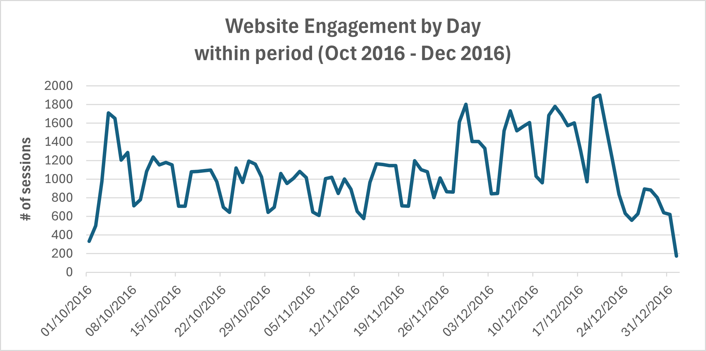
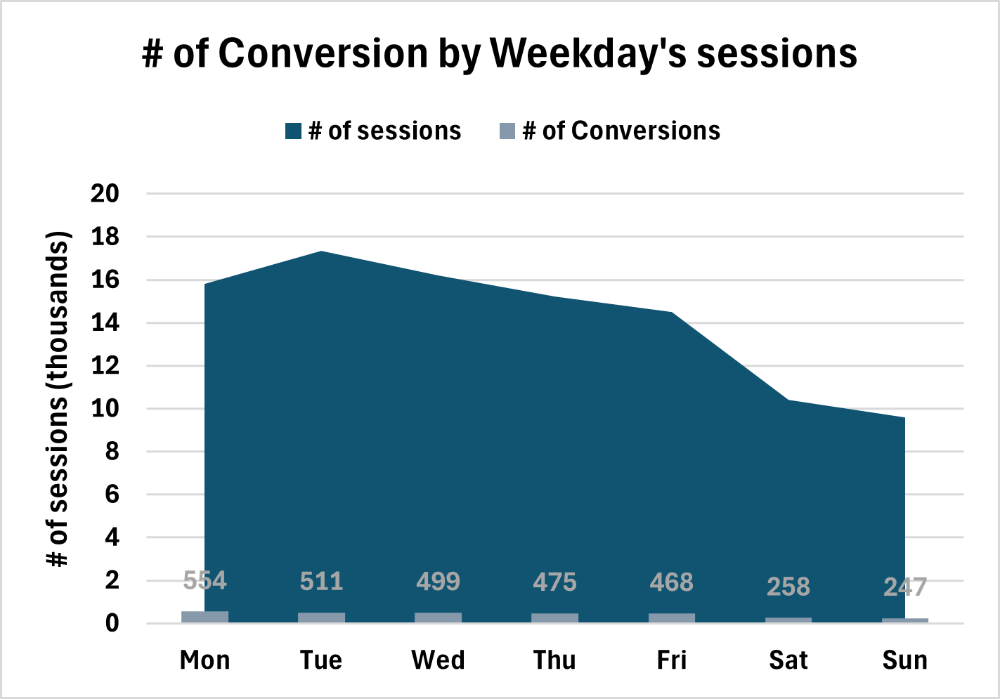
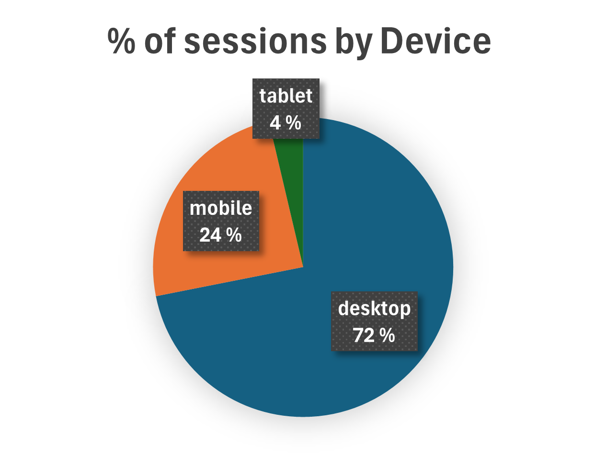
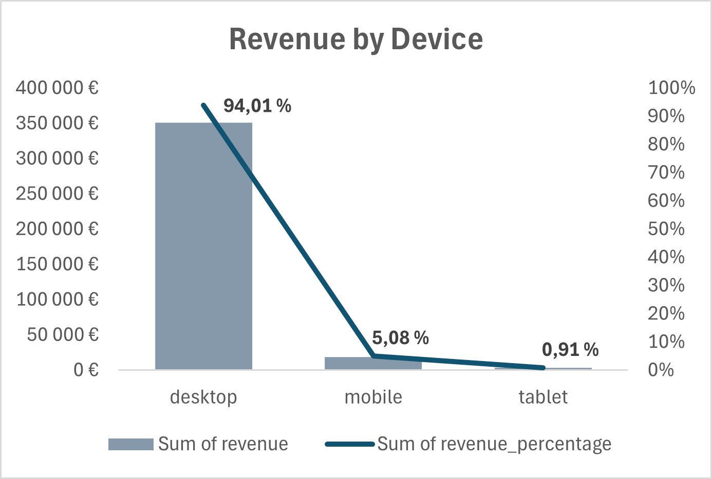
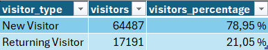
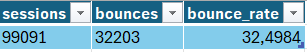
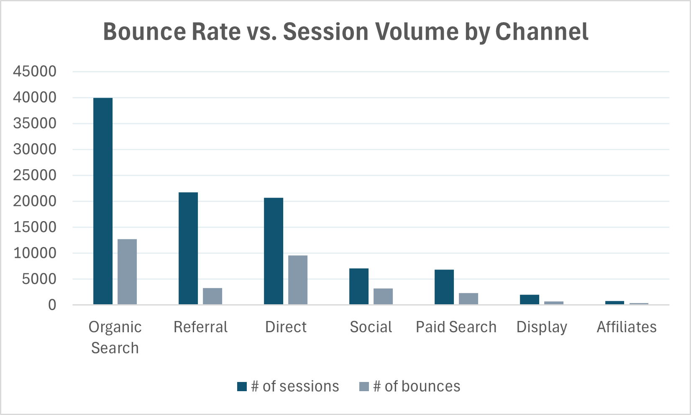
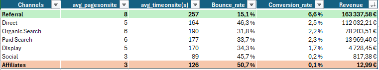
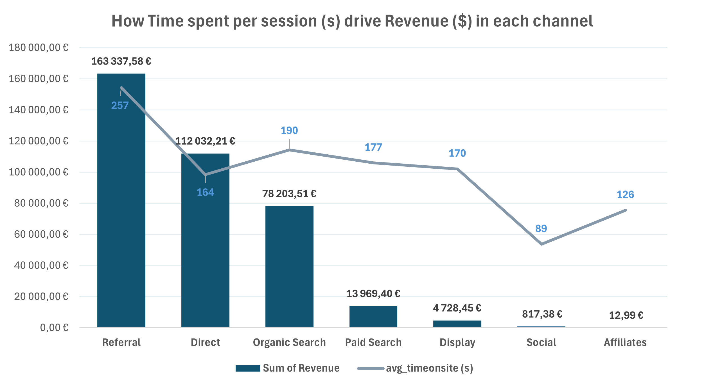

# Digital Marketing Strategy Optimisation

## Dataset

We'll be exploring the [Google Merchandise Store](https://www.googlemerchandisestore.com/) dataset, containing data on website users from the US from October 1, 2016, to December 31, 2016. This dataset is sourced from the Google Merchandise Store, a real e-commerce platform offering Google-branded merchandise, including apparel, lifestyle products, and stationery from Google and its brands. While some sensitive fields have been obfuscated for privacy reasons, this dataset provides a unique opportunity to analyze actual customer behavior and trends in an e-commerce setting.

*Disclaimer: for this analysis, certain fields within the dataset have been aggregated. The original dataset is available as a public dataset in Google BigQuery.*

## Situation

The Google Marketing Team in the US was facing challenges in several key areas of their online business. Despite having a robust platform and a diverse range of products, the company was not fully leveraging its potential. With various strategies and channels in play, it was quite challenging to accurately assess the impact of different marketing initiatives and prove their effectiveness to stakeholders.

To address these challenges, the Google Marketing Team focused on gaining insights into several key areas:

- How do users interact with our e-commerce platform? Are there specific user behaviors or patterns that can inform our marketing strategies?
- How effective are our promotional campaigns and discount strategies in driving sales? Do these initiatives lead to long-term customer retention or only short-term gains?
- How does the user experience on our website and mobile app impact sales and customer engagement? Are there areas in need of improvement?
- Which geographical markets or customer segments are most profitable? Are there emerging markets or segments that we should focus on?
- How effective are our current strategies in acquiring new customers and retaining existing ones?
- Which traffic channels are yielding the highest conversion rates? What are the underlying reasons for variations in conversion rates across different channels?

## **Task**

As the new marketing analyst at Google, my task involved conducting a detailed analysis of the e-commerce platform's performance. My main objective was to develop actionable strategies that would enhance overall performance. This included focusing on key areas such as customer acquisition, retention, monetization, and more efficient use of marketing channels. The ultimate aim was to significantly boost overall revenue.

## Action

In my role as a marketing analyst at Google, I used SQL to create a database and merge multiple datasets into a unified one for in-depth analysis, followed by thorough data preprocessing, including cleansing to ensure accuracy and reliability. I then conducted advanced analyses using advanced string, date and window functions to gain deeper insights into the website's performance, focusing on user interactions and the effectiveness of our e-commerce strategies. Additionally, I analyzed various web traffic sources to identify the most effective channels for driving sales and conversions, turning data into actionable business intelligence.

## Set Up

In MySQL Workbench, we’ll create a new database called **`gms_project`**. This database will be used to store tables and data as part of our project.

## Data Exploration

1. **Check COMPLETENESS:** 

—> (column: visitid): null?(0) duplicate?(956) 

1. **Check for unique identifier for each session**
2. **Check CORECTNESS** 

—> date format

## Business Insights

### **Website Engagement by Day → Conversion Rate by Weekday**

First, we'll explore daily web traffic to gain insights into overall website performance. This initial step will reveal key traffic patterns and trends in visitor behavior.

*Note: For simplicity, our analysis will use UTC time for all timestamps, avoiding the complexities of time zone conversions and Daylight Saving Time adjustments.*

  

  

**Observations:**

- Web traffic consistently **peaks during weekdays** and **tapers off during weekends**
- **An uptick in web traffic** as we approach the holiday season **in December**

To better illustrate this trend, we'll extract the name of the day from the visit date.

  

- Pattern: **Peaking mid-week**, particularly on Tuesdays and Wednesdays, and then **declining over the weekend**

⇒  User engagement on the website fluctuates throughout the week, but **more engagement in weekday**

⇒ This insight can be crucial for planning content updates and marketing initiatives

*How is the **Conversion Rate by Weekday?*** 

  

**Observations:**

- While **Tuesdays see the most website visits**, it's interesting to note that **Mondays have the highest conversion rate**.
- In contrast, **weekends experience a substantial drop in conversions**

⇒ More conversions on the first half of the week.

*******************************************************

**WHY IS THAT?** 

NEED MORE INFORMATION ON THAT. 

Is that something due to **OBJECTIVE reasons** e.g. customers are more interested in other activities on weekend and not on the Internet or our specific Website?

**Other reasons:**

- The Website is not visible on other ways to attract the customer
- There is no direct way for customers to land to the Website when they are reminded of the Website or suddenly interested into

### **Website Engagement & Monetization by Device**

—> Reveal variations in conversion rates and visits across desktops, tablets, and smartphones

  
  

**Observation:**

- **Significant discrepancy:** ~24% of sessions originate from mobile devices, only 5% of revenue is generated through them.

⇒  **a need to optimize the mobile shopping experience**

⇒ Marketing strategies should focus on enhancing mobile usability, streamlining the checkout process, and tailoring mobile-specific promotions

***Consideration***: Considering the significant number of users who shop on their mobile devices during commutes or workday breaks, a seamless mobile experience on our e-commerce platform is crucial. To further tap into this growing user base, Google might also consider developing a dedicated mobile app, which could substantially increase revenue from mobile users.

### **Website Retention**

Next, we’ll examine website retention, specifically focusing on whether users are new or returning. This will provide insights into user loyalty and the effectiveness of strategies in encouraging repeat visits. Typically, having around 50-70% new users and 30-50% returning users is considered a good balance.

  

**Observation:**

- About **80% of users visit the website only once**

—>  a need for better incentives or value propositions to encourage repeat visits, for enhanced retention strategies such as personalized marketing, loyalty programs, or targeted retargeting campaigns

- In contrast, **the substantial influx of new visitors reflects successful marketing efforts in brand awareness**, effectively attracting people to the site initially.

### **Website Acquisition**

This measure is key as it indicates the proportion of visitors who exit the site after viewing only one page and is often used to evaluate the effectiveness of acquisition strategies. 

  

**Observation:**

- A **bounce rate within the 20-40% range is generally seen as effective engagement**.

—> *Let’s look at this bounce rate by Channel*

  

**Observations:**

- **Referral shows the lowest bounce rate (~15%)**

→ Marking **Referral** as particularly healthy

- **Organic Search, Paid Search, and Display** exhibit bounce rates of **30-40%**

→ Effective visitor engagement among the 3 channels

- **Direct, Social, and Affiliates**, with bounce rates of **40-50%**

→ There is potential for improvement

To give us a fuller **view of each channel's performance,** we'll next include **key metrics like time on site, revenue, and conversion rate.**

### **Website Acquisition & Monetization by Channel**

→ Encompassing not only traffic volume but also user **engagement quality, revenue generation efficiency, and overall conversion impact**

  

**Observations:**

- **Referral leads** with the **lowest bounce rate** and **highest conversion** at 7%, **driving strong revenue**, making it a prime candidate for expanded partnerships
- **Organic Search**, with the most sessions and **a solid 32% bounce rate**, shows **robust SEO efficacy** and **good conversion** potential.
- **Direct traffic**, while **high at a 46% bounce rate**, has **moderate conversions →** suggesting a need for more personalized engagement
- **Social media**, despite **high traffic**, suffers from the **lowest conversions →** calling for more targeted campaigns.
- **Paid Search and Display**, both with 34% bounce rates, demonstrate moderate visitor retention but require improved targeting for better conversions.
- **Affiliates**, with the ***highest bounce rate*** and ***lowest conversions →*** need a thorough evaluation of partner quality.

  

**Observations:**

- **Referral, Direct, Organic Search, Social** 
These channels show the expected correlation: *l**onger session durations tend to generate higher revenue*.**
- **Paid Search and Display**, 
Despite moderate session times, these channels underperform in revenue — generating ***10x lower returns compared to top-tier channels***.
- **Affiliate**  
Revenue contribution does not align with the relatively healthy average session duration.

⇒ **Traffic quality matters more than quantity:** Channels that attract high-intent, brand-aware users (Direct, Organic, Referral) outperform those optimized for reach (Paid, Display, Affiliate).

**⇒ Optimization opportunity:** Paid and Affiliate channels need better targeting, messaging, and landing page alignment to convert their traffic into meaningful revenue.

### Results

In conclusion, let's recap our recommendations below to summarize the key strategies and insights derived from our analysis.

1. **Seasonal and Holiday Campaigns**: During key periods, such as the December holidays, create themed promotions and exclusive holiday deals. Develop holiday guides, offer limited-time discounts, and run festive-themed marketing campaigns to attract shoppers. Replicating this strategy in other months could potentially lead to a 25% uplift in revenue, akin to what is typically seen in December.
2. **Maximize Monday Conversions**: With Mondays having the highest conversion rates but lower traffic, aim to boost Monday traffic by at least 10% to reach Tuesday levels. Launch start-of-the-week promotions and exclusive deals, and actively promote these through targeted email and social media campaigns early in the week.
3. **Targeted Weekday Promotions**: Leverage the high traffic on Tuesdays and Wednesdays with special promotions and deals. Tailor your email marketing and social media campaigns to coincide with these peak days, ensuring promotions reach users when they are most active online.
4. **Weekend Engagement Strategies**: Use retargeting ads to re-engage weekday visitors with special weekend promotions. Implement loyalty programs offering rewards for weekend shopping to boost off-peak traffic and sales by 15%.
5. **Enhance Mobile Experience**: With 25% of sessions but only 5% of revenue coming from mobile, and considering that many users shop during commutes or workday breaks, focus on improving the mobile shopping experience. This could involve optimizing the mobile site's user interface, offering mobile-specific deals, or enhancing mobile payment options.
6. **Focus on High-Value Regions**: Address the disproportionate revenue contribution from Washington and Illinois. Develop targeted marketing strategies for these regions, possibly with localized offers or campaigns, to capitalize on their higher spending patterns.
7. **Strengthen User Engagement and Retention**: With 80% one-time visitors, target a 10% increase in repeat visits by enhancing the user experience for first-time visitors through personalized content, retargeting campaigns, and loyalty programs. Focus on engaging direct traffic with personalized strategies to reduce its high bounce rate.
8. **Optimize Referral and Organic Channels**: Due to their low bounce rate and high conversion, aim to increase referral traffic by 20% through expanded partnerships. Continue to improve SEO for Organic Search, which shows robust session numbers and a good potential for conversions.
9. **Revamp Social Media and Paid Channels**: Redesign social media campaigns for higher engagement and conversion. Improve targeting in Paid Search and Display advertising to reduce the 34% bounce rate and enhance visitor retention.
10. **Reevaluate and Enhance Affiliate Strategies**: Thoroughly assess affiliate partnerships, focusing on the quality and relevance to address their high bounce rate and low conversions. Restructure or terminate underperforming affiliations to improve efficiency.

These recommendations aim to capitalize on identified trends and insights, maximizing revenue opportunities throughout the year.

### Next Steps

Moving forward, our analysis could delve into several key areas to further enhance our understanding and strategy:

1. **Peak Hours Analysis:** We could investigate the specific hours of the day that yield the highest number of website visits and conversions. This would help us optimize our engagement strategies to target peak activity times.
2. **Regional Performance:** We could examine regions with a high number of visits but low conversion rates to identify potential barriers to conversion, and then tailor our regional strategies accordingly.
3. **Buyer Behavior Segmentation:** We could segment and analyze two distinct customer groups: bulk buyers versus individual purchasers. Understanding their differing motivations and behaviors can inform targeted marketing and sales tactics.
4. **Transaction Value Assessment:** We could evaluate the average value of each transaction. A low average order size or value might indicate potential revenue losses, underscoring the need for strategic adjustments.

These focused analyses would provide deeper insights, enabling us to refine our strategies and drive more effective and targeted marketing initiatives.

